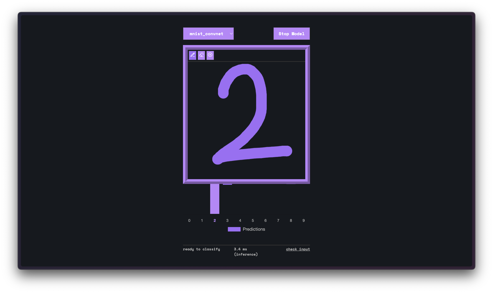
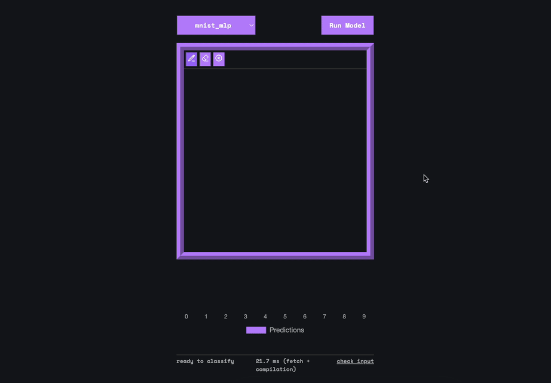

# MNIST



## Overview

This project combines **TinyGrad** and **WebGPU** to train and deploy **handwritten digit classifiers (MLP and CNN)** entirely in the browser.
Models are trained on the **MNIST dataset** using **TinyGrad**, exported in the **`.safetensors` WebGPU format**, and then used for **real-time inference** in a web application.

The **web app** is a **single-page application (SPA)** built with **vanilla JavaScript** and **CSS**, using **Vite** as the build tool and hosted on **GitHub Pages**.
It allows you to **draw digits**, **switch between models**, and **see live predictions** powered directly by your **GPU**.

> The goal of this project is to explore an **end-to-end deep learning workflow** — from **hyperparameter optimization** and **TinyGrad training** to **efficient WebGPU inference**, all with minimal dependencies and modern web technologies.

[](https://stantonik.github.io/mnist)

**[Access the live demo](https://stantonik.github.io/mnist)**

---

## Features

* **Model selection** — toggle between **MLP** and **CNN**
* **Interactive canvas** — draw digits with pen, eraser, and clear tools
* **Real-time classification** — inference directly on GPU
* **Probability bar chart** — visualization of class confidence (0–9)
* **Training utilities** — Python scripts for local experiments and analysis
* **Hyperparameter exploration** — full methodology in [**docs/hyperparameters.md**](./docs/hyperparameters.md)

---

## Model Summary

| Model   | Architecture  | Accuracy   | Activation | Optimizer | Batch Size | Epochs | Max LR |
| ------- | ------------- | ---------- | ---------- | --------- | ---------- | ------ | ------ |
| **MLP** | 2 × 512       | **98.3 %** | SiLU       | Adam      | 128        | 10     | 1e-3   |
| **CNN** | 4 × (32 → 64) | **99.3 %** | SiLU       | Adam      | 64         | 5      | 3e-3   |

Both models use a **plateau-based learning rate scheduler** for smoother convergence.

---

## Installation

### 1. Install dependencies

Install **`dawn`**, required to export trained models to WebGPU format.

**macOS:**

```bash
brew tap wpmed92/dawn && brew install dawn
```

**Linux:**
Refer to your distribution’s documentation for manual installation.

Then install **[TinyGrad](https://github.com/tinygrad/tinygrad)**:

```bash
git clone https://github.com/tinygrad/tinygrad.git
cd tinygrad
python3 -m pip install -e .
```

---

### 2. Clone this project

```bash
git clone https://github.com/stantonik/mnist.git
cd mnist
```

---

### 3. Train models locally

Use the provided Python scripts to train and export models:

```bash
cd train

# Train MLP
TYPE=mlp B=128 LR=0.001 OPT=adam ACT_FN=silu EPOCHS=10 python train.py

# Train CNN
TYPE=conv B=64 LR=0.003 OPT=adam ACT_FN=silu EPOCHS=5 python train.py

# Run hyperparameter experiments with plots (N between 1 to 5)
TYPE=conv TESTS=N python train.py
```

Trained models are saved as `.safetensors` files in `app/public/models/`.

---

### 4. Run the WebGPU application (Vite)

To preview and test your trained models in the browser:

```bash
cd app
npm install
npm run dev
```

Then open the local development server (usually [http://localhost:5173](http://localhost:5173))
You can draw digits, switch between MLP and CNN, and view predictions in real time.

---

### Notes

* Adjust training hyperparameters (learning rate, optimizer, etc.) in `HPConfig` inside the training script.
* `.safetensors` models can be reloaded directly by the WebGPU app.
* Requires a browser with **WebGPU support** (Chrome 113+, Edge, or Safari Technology Preview).

