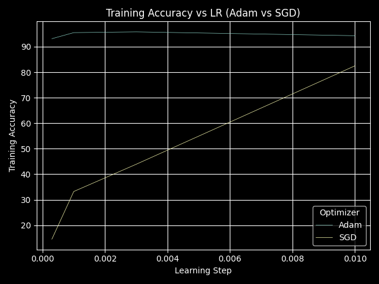
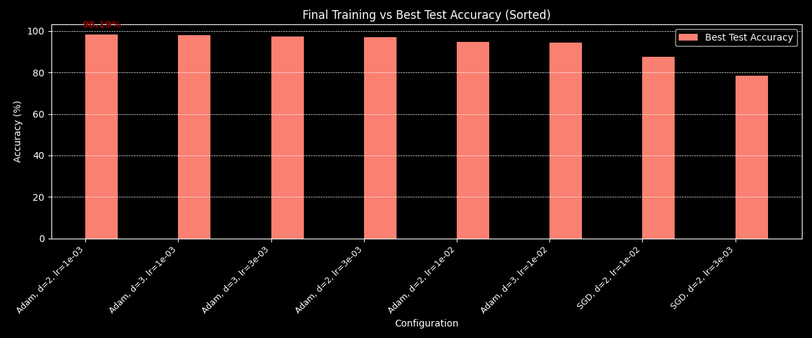
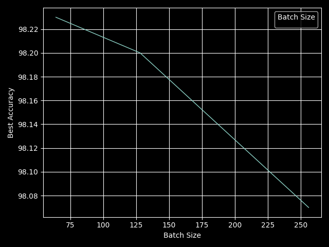
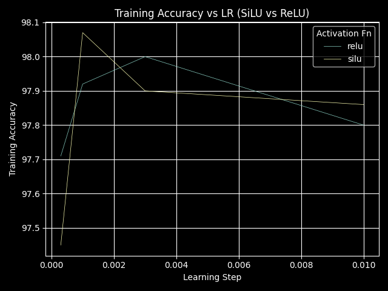
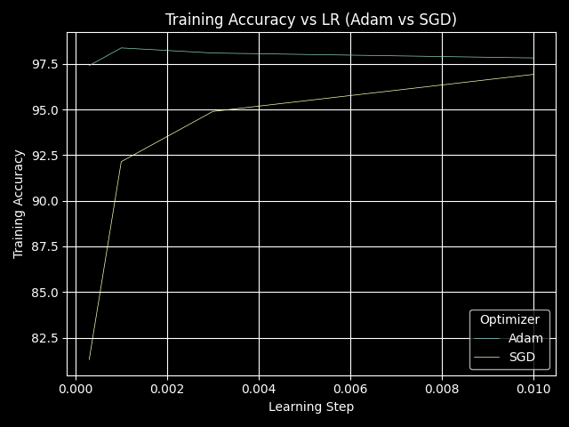
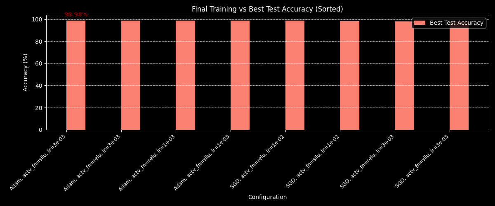

# MNIST Hyperparameter Exploration

## Research Overview

Before experimenting, I reviewed which hyperparameters typically have the **strongest effect** on MNIST performance and their common value ranges.

| **Hyperparameter**      | **Typical Value / Range** | **Effect / Notes**                                                                             | **Importance**  |
| ----------------------- | ------------------------- | ---------------------------------------------------------------------------------------------- | --------------- |
| **Learning Rate**       | 1e-3 (1e-4 – 1e-2)        | Controls convergence speed. Too large → unstable; too small → slow training.                   | **High**        |
| **Epoch Count**         | 5–10 (MLP), 1–5 (CNN)     | Too few → underfit; too many → diminishing returns after convergence.                          | **High**        |
| **Optimizer**           | Adam, SGD                 | Adam converges faster on MNIST; optimizer choice strongly impacts convergence behavior.        | **High**        |
| **Network Width**       | 128–1024                  | More neurons → higher capacity. Too small → underfit; too large → slower and prone to overfit. | **Medium-High** |
| **Network Depth**       | 1–5                       | More layers → higher expressiveness. 2–3 layers usually optimal; too deep → harder to train.   | **Medium-High** |
| **Batch Size**          | 32–256                    | Small batches → noisy but fast updates; large batches → smoother convergence, slower per step. | **Medium**      |
| **Activation Function** | SiLU, ReLU                | Influences gradient flow. SiLU or ReLU recommended for stable and fast convergence.            | **Medium**      |
| **Learning Rate Decay** | 0.8–0.99                  | Gradually reduces learning rate to improve convergence stability.                              | **Low-Medium**  |
| **Patience**            | 5–50                      | Controls when to trigger LR decay or early stopping.                                           | **Low**         |

**Top priorities:** Learning Rate, Optimizer, Network Width/Depth, Batch Size, Activation Function

---

## Overall Strategy

1. **Establish a baseline** configuration with reasonable defaults.
2. **Reduce configuration space** by running single-parameter sweeps to identify non-critical parameters.
3. **Explore combinations** of relevant parameters (learning rate, optimizer, depth).
4. **Refine promising configurations** into a shortlist of top-performing sets.
5. **Analyze performance** with plots of test/train accuracy vs steps to check over/underfitting.
6. Apply the same methodology for **both MLP and CNN models**.

---

## MLP Training

### Phase 1 – Baseline Configuration

```python
@dataclass
class HPConfig:
    batch_size: int = 64                                     # Batch Size
    lr: float = 1e-3                                         # Learning Rate
    lr_decay: float = 0.9                                    # Learning Rate Decay
    patience: int = 50                                       # Patience (for LR scheduling)
    opt: Callable[[list[Tensor]], Optimizer] = nn.optim.Adam # Optimizer
    width: int = 512                                         # Neurons per hidden layer
    depth: int = 2                                           # Number of hidden layers
    activation_fn: Callable[[Tensor], Tensor] = Tensor.silu  # Activation Function
    epochs: int = 1                                          # Training Epochs
```

---

### Phase 2 – Reduce Configuration Space

From the hyperparameter table, the full set of possibilities is:

```python
lrs = [1e-4, 3e-4, 1e-3, 3e-3, 1e-2]
depths = [1, 2, 3, 4, 5]
widths = [128, 256, 512, 1024]
batch_sizes = [32, 64, 128, 256]
opts = [nn.optim.Adam, nn.optim.SGD]
activation_fns = [Tensor.relu, Tensor.silu]
```

This results in **1600 possible configurations**, which is too many to test exhaustively.
I performed **single-parameter sweeps** to narrow down the critical hyperparameters.

#### Network Width and Depth

```bash
Best accuracy (95.25%) for depth=2 and width=1024
```


Training time grows significantly with wider layers:


Since the accuracy gain from 512 → 1024 is marginal, **width=512** is chosen for efficiency

```python
depths = [2]
widths = [512]
```

#### Batch Size


Batch size around **128** gives the best trade-off:

```python
batch_sizes = [128, 256]
```

#### Activation Function


The choice between SiLU and ReLU does not significantly affect results. **SiLU** is selected.

#### Optimizer



Adam clearly outperforms SGD for the MLP, so **Adam** is preferred.

---

### Phase 3 – Final Parameter Sweep

Remaining possibilities:

```python
lrs = [1e-4, 3e-3, 1e-3]
depths = [2, 3]
widths = [512]
batch_sizes = [128]
opts = [nn.optim.Adam, nn.optim.SGD]
activation_fns = [Tensor.silu]
```

This results in **16 configurations**. After testing, configurations with `(SDG, depth=3)` and `(SDG, lr=1e-3)` were discarded.

#### Top 8 Configurations

| ID | Optimizer | Learning Rate | Depth |
| -- | --------- | ------------- | ----- |
| 1  | Adam      | 3e-3          | 2     |
| 2  | Adam      | 1e-3          | 2     |
| 3  | Adam      | 1e-4          | 2     |
| 4  | Adam      | 1e-4          | 3     |
| 5  | Adam      | 3e-3          | 3     |
| 6  | Adam      | 1e-3          | 3     |
| 7  | SGD       | 3e-3          | 2     |
| 8  | SGD       | 1e-3          | 2     |

Classement:



---

### Phase 4 – Refinement

Further analysis can be done by plotting **train accuracy vs test accuracy per step** for the top configurations.
This helps detect **underfitting or overfitting** and guides final fine-tuning.

---

## CNN Training

The same methodology applies, but with slight adjustments:

* Fewer epochs (1–5) are typically sufficient.
* Convolutional layers increase sensitivity to **batch size** and **learning rate** interactions.

#### Batch Size



Batch size around **64** gives the best trade-off:

#### Activation Function



SiLU seems to be prefered.

#### Optimizer



Adam clearly outperforms SGD for the MLP, so **Adam** is preferred.

#### Top 8 Configurations

| ID | Optimizer | Learning Rate | 
| -- | --------- | ------------- |
| 1  | Adam      | 3e-3          |
| 2  | Adam      | 1e-3          |
| 3  | Adam      | 1e-4          |
| 4  | Adam      | 1e-4          |
| 5  | Adam      | 3e-3          |
| 6  | Adam      | 1e-3          |
| 7  | SGD       | 3e-3          |
| 8  | SGD       | 1e-3          |

Classement:



---

## Conclusion

**Initial Run**

| Model         | Learning Rate | Accuracy |
| ------------- | ------------- | -------- |
| mnist_mlp     | 2.00e-02      | 87.36%   |
| mnist_convnet | 2.00e-02      | 97.96%   |

**Final Run (Best Configuration)**

| Model   | Architecture  | Accuracy   | Activation | Optimizer | Batch Size | Epochs | Max LR |
| ------- | ------------- | ---------- | ---------- | --------- | ---------- | ------ | ------ |
| **MLP** | 2 × 512       | **98.6 %** | SiLU       | Adam      | 128        | 10     | 1e-3   |
| **CNN** | 4 × (32 → 64) | **99.3 %** | SiLU       | Adam      | 64         | 5      | 3e-3   |

---

